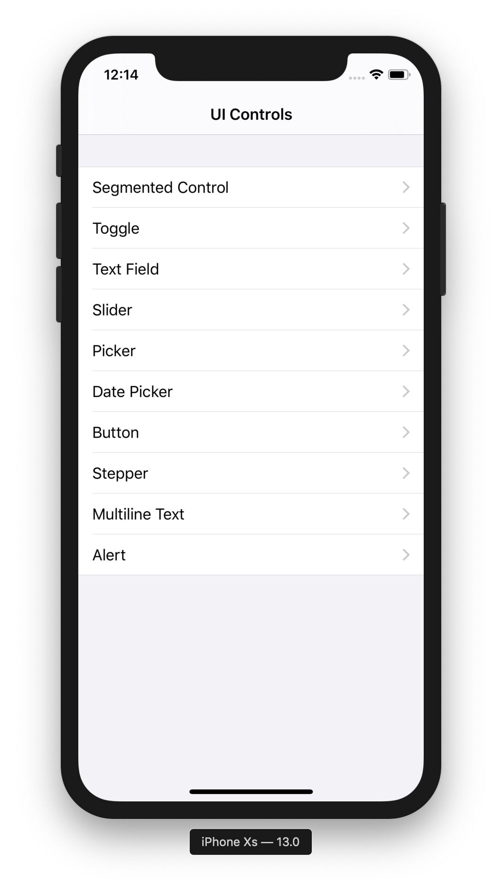
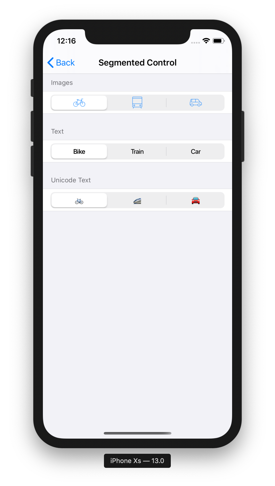
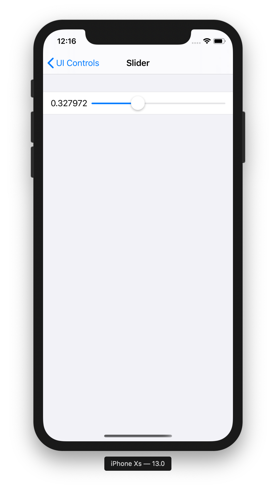
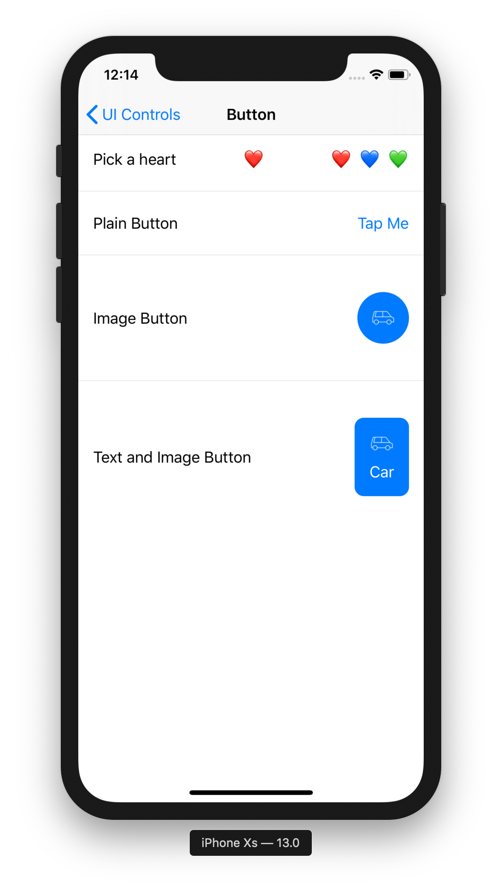
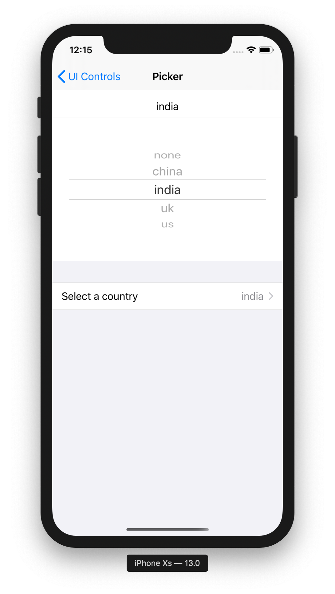

# SwiftUI - UIControls

### Contents
SwiftUI-UIControls is a demo of all the different ways to use and customize UIControls in SwiftUI.

# UIControls

## SegmentedControl
- Image
- Text
- Unicode Text

## Toggle
## TextField
- Plain
- Rounded Border
- Right Aligned
- Secure

## Slider

## Button
- Unicode Text
- Plain
- Image
- Image and Text with background and rounded corners

## Stepper
## Date Picker

## Picker
 
